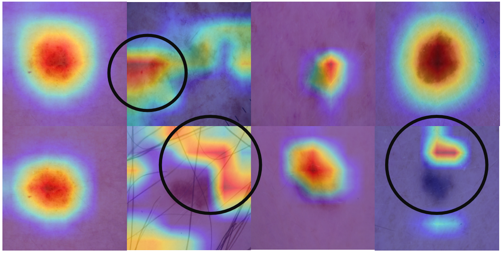

# 多模态疾病分类诊断（HAM10000 + Spine）

## 摘要
本项目围绕“图像 + 文本”多模态诊断展开，基于课程基线完成复现，并在 HAM10000 皮肤病数据集与 Spine 脊柱数据集上开展系统改进。我们聚焦融合策略、分级特征、分类头增强、长尾优化与拟人化诊断思路，形成覆盖基础题与提高题的完整实验链路，并给出结构化对比结果。

## 病灶示例

## 任务与数据
任务为多模态分类：图像（ResNet/ConvNeXt）+ 文本（BERT）。数据集覆盖 HAM10000（7 类）与 Spine（6 类），用于检验跨场景稳定性与泛化能力。

## 方法概述
**基线模型**：ResNet 提取图像特征，BERT 提取文本特征，拼接后经 MLP 分类，用作最低参考线。  
**融合改进（提高题3）**：对比 concat、element‑wise、门控融合、交叉注意力、双向共注意力与低秩双线性等策略，验证语义对齐带来的增益。  
**分级特征（提高题4）**：图像端引入多层特征（layer2/3/4），文本端引入多层隐藏状态（4/8/12），逐层交互并进行自适应加权。  
**分类头增强（提高题5）**：引入 KAN 分类头、残差 MLP、注意力池化与 MoE（ConNeXT），强调非线性表达与专家分工。  
**拟人化诊断（提高题6）**：病灶/上下文双专家门控、Global‑Local 双流、2.5D 伪 3D、序列建模、多视角 Cross‑Attention、RANGM 简化叙述、TTA 推理增强。  
**强表征迁移**：MIBF‑Net（IBFA + MP‑Loss）与 ConNeXT（ConvNeXt + MoE）作为性能上限路线。

## 提高题 3/4/5/6 进一步说明
**提高题3（融合）**：我们把“语义对齐能力”作为第一目标，因此优先评估交叉注意力与门控融合。结果显示交叉注意力能更稳定地利用文本辅助信息，而双向共注意力在文本稀疏场景下容易引入噪声。  
**提高题4（分级特征）**：医学影像的关键证据往往存在于中层纹理与边缘信息，因此引入多层特征并做层间交互。逐层融合让浅层纹理与深层语义协同决策，减少“只看最后一层”的信息损失。  
**提高题5（分类头）**：分类头改造强调“更强非线性 + 更清晰决策边界”。KAN 提升复杂边界拟合能力，MoE 通过专家分工处理不同模式，残差/注意力池化提高训练稳定性。  
**提高题6（拟人化）**：拟人化策略强调“病灶证据 + 上下文证据”动态权衡。Global‑Local 与 2.5D/序列建模模拟医生的“前后切片对照”，但也可能引入背景偏置，因此需要门控或权重调节保持稳定性。

## 实验设计
坚持“单变量控制”原则，保持除目标模块外其余配置一致，分别在 HAM 与 Spine 上验证，确保差异可归因。

## 整体对比结果（最优性能）

| 模型 / Backbone | 数据集 | 核心思路 | 准确率 (%) |
| --- | --- | --- | --- |
| MIBF‑Net (ResNet50) | HAM | IBFA + MP‑Loss | 92.48 |
| MIBF‑Net (ResNet50) | Spine | IBFA + MP‑Loss | 91.52 |
| ConNeXT (ConvNeXt + MoE) | HAM | MoE 分类头 | 92.8 |

## 超参数敏感性（提高题1）

**HAM10000**：

| LR | Batch | Hidden | Drop | Acc (%) |
| --- | --- | --- | --- | --- |
| 1e‑4 | 32 | 256 | 0.5 | 88.50 |
| 1e‑5 | 32 | 256 | 0.5 | 82.60 |
| 1e‑3 | 32 | 256 | 0.5 | 75.91 |
| 1e‑4 | 16 | 256 | 0.5 | 84.27 |
| 1e‑4 | 64 | 256 | 0.5 | 86.75 |
| 1e‑4 | 32 | 128 | 0.5 | 86.81 |
| 1e‑4 | 32 | 512 | 0.5 | 86.07 |
| 1e‑4 | 32 | 256 | 0.3 | 86.44 |
| 1e‑4 | 32 | 256 | 0.7 | 85.33 |

**Spine**：

| LR | Batch | Hidden | Drop | Acc (%) |
| --- | --- | --- | --- | --- |
| 1e‑4 | 32 | 256 | 0.5 | 87.41 |
| 1e‑5 | 32 | 256 | 0.5 | 86.66 |
| 1e‑3 | 32 | 256 | 0.5 | 85.59 |
| 1e‑4 | 16 | 256 | 0.5 | 87.19 |
| 1e‑4 | 64 | 256 | 0.5 | 87.30 |
| 1e‑4 | 32 | 128 | 0.5 | 87.19 |
| 1e‑4 | 32 | 512 | 0.5 | 88.05 |
| 1e‑4 | 32 | 256 | 0.3 | 88.58 |
| 1e‑4 | 32 | 256 | 0.7 | 87.30 |

**结论简述**：HAM 对学习率更敏感，Spine 对网络容量与正则化更敏感，提示两类任务的“最优超参区间”并不一致。

## 融合策略对比（提高题3，HAM）

| 融合策略 | 思路 | Acc (%) |
| --- | --- | --- |
| Concat | 简单拼接 | 88.50 |
| Element‑wise Add | 强调共性 | 88.67 |
| Element‑wise Mult | 强相关抑噪 | 88.87 |
| Gated Fusion | 动态加权 | 88.73 |
| Cross‑Attention | 单向语义对齐 | 89.11 |
| Bi‑directional Co‑Attention | 双向对齐 | 85.45 |
| Low‑rank Bilinear | 高阶交互 | 87.31 |

**结论简述**：交叉注意力在语义对齐上最具优势；双向共注意力受文本稀疏影响较大，容易引入噪声。

## 提高题 5/6 全量对比（完整呈现）

| 类别 | 方法 | HAM Acc (%) | Spine Acc (%) |
| --- | --- | --- | --- |
| 分类头 | KAN（替换基线 MLP） | 90.94 | 87.62 |
| 分类头 | 残差/注意力分类头 | 89.73 | 88.64 |
| 分类头 | MoE 分类头（ConNeXT） | 91.08 | — |
| 迁移表征 | MIBF‑Net（ResNet50 迁移） | 92.48 | — |
| 迁移表征 | MIBF‑Net（ResNet50 迁移） | — | 91.52 |
| 迁移表征 | ConNeXT（ConvNeXt + MoE） | 92.8 | — |
| 目标函数 | 模态分歧监督（对称 KL） | 88.92 | 87.33 |
| 目标函数 | Focal / Weighted Sampler | 87.76 | 86.54 |
| 拟人化 | Dual‑Expert Gate | 89.10 | 84.69 |
| 拟人化 | Global‑Local 双流 | 89.77 | 86.71 |
| 拟人化 | 2.5D 伪 3D | 86.52 | 84.39 |
| 拟人化 | 序列建模（BiLSTM/Transformer） | 90.17 | 87.24 |
| 拟人化 | 多视角 Cross‑Attn | 88.62 | 85.93 |
| 其他 | RANGM 简化叙述 | 90.64 | — |
| 其他 | SSM/Mamba 融合 | 91.28 | — |
| 其他 | TTA 推理增强 | 90.03 | — |

## 结论
强表征迁移（MIBF‑Net 与 ConNeXT）提供了最稳定的性能上限；融合对齐与分类头增强在 HAM 上体现出稳定增益；拟人化与结构建模策略在 Spine 上更具解释性，但受样本形态差异影响存在波动。总体来看，跨模态对齐 + 强表征迁移是提升多模态医学诊断性能的关键路径。
